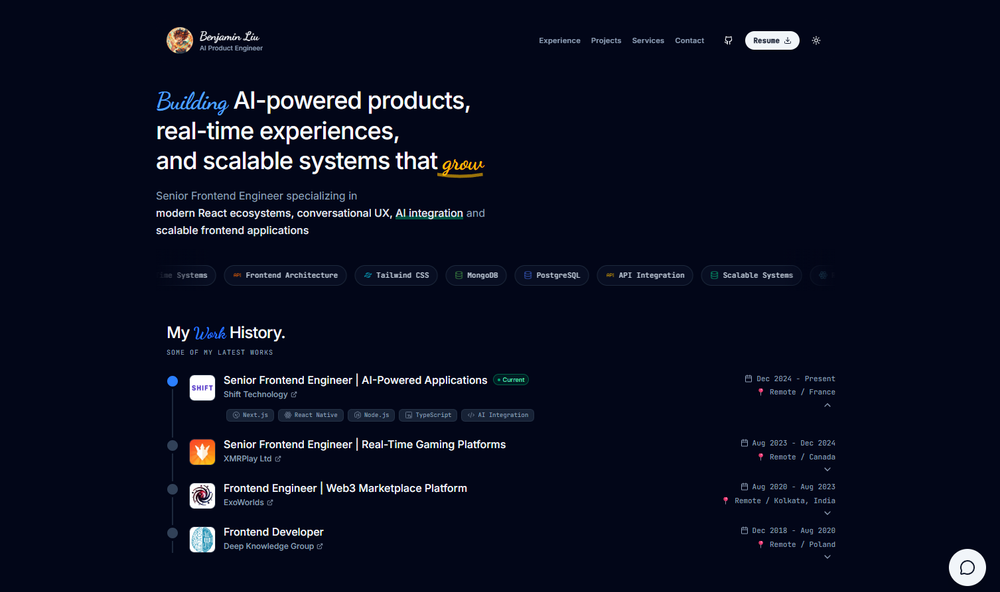
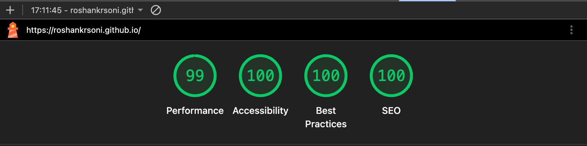

<div align="center">
  
  
  <br /><br />

  <h1 align="center"><a href="https://benbuilds.vercel.app" target="_blank" style="text-decoration:none; color:inherit;">Benjamin Liu - Personal Portfolio</a></h1>
  
  <p align="center">
    <strong>Senior Software Engineer | React & React Native | AI Integration</strong><br>
    My personal portfolio built to showcase my work, experience, and general coding aesthetic.
  </p>

  <p align="center">
    <a href="https://benbuilds.vercel.app" target="_blank">
      
    </a>
  </p>
</div>

---

## 👋 Hey there!

Welcome to the repo for my personal website. I built this to serve as my digital resume, focusing heavily on clean design, fast load times, and good accessibility. 

The site natively supports system-based Dark and Light modes, fluid scroll animations, and responsive layouts for mobile viewing.

---

## ⚡ Performance

I've put a lot of effort into making this site fast and accessible. By aggressively splitting code chunks in Vite and ensuring solid ARIA labels throughout the UI, the site currently holds a perfect 100/100 across the board on Lighthouse. Check it out:

<div align="center">
  
</div>

<br />

---

## 🛠️ Built With

Nothing crazy—just solid modern tools:
- **React 19 & Vite 6** - For the core engine and lightning-fast builds.
- **Tailwind CSS v4** - Makes styling the dark mode and responsive layouts a breeze.
- **Motion API** - For all the slick micro-animations.
- **Lucide & React Icons**

---

## 🏃‍♂️ Running it locally

If you want to spin this up on your own machine to poke around the code:

```bash
# Clone the repository
git clone https://github.com/benbuilds2124/personal-portfolio.git
cd personal-portfolio

# Install deps
npm install

# Start the dev server
npm run dev
```

To build and deploy to GitHub Pages, I just use:
```bash
npm run deploy
```

---

## ✌️ Feel free to use it!

This code is open-sourced, so you're totally welcome to use it as a template for your own portfolio. 

All I ask is that you swap out my personal details and give me a quick credit somewhere (like your footer or README).

<br />
<div align="center">
  <i>Built with ❤️ by Benjamin Liu.</i>
</div>
